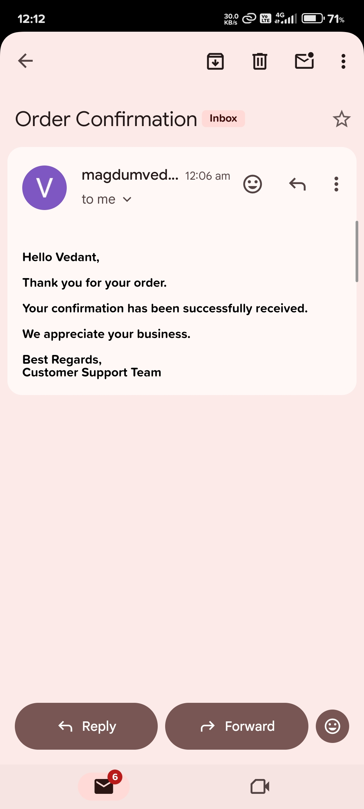

# Automated Email Notification System

## Overview

This project is a Python-based Automated Email Notification System that sends personalized confirmation emails to customers.

The application reads customer details from a CSV file, generates personalized email messages, and sends them using Gmail SMTP.

Sensitive credentials are securely stored in a `.env` file using the `python-dotenv` package.

---

## Features

- Read customer data from CSV
- Personalized confirmation emails
- Gmail SMTP integration
- Secure credential management using `.env`
- Email success/failure logging
- Easy to extend for bulk email notifications

---

## Tech Stack

- Python
- smtplib
- email.mime
- python-dotenv
- CSV

---

## Project Structure

```
Automated-Email-Notification-System
│
├── data/
│   └── customers.csv
│
├── src/
│   ├── email_sender.py
│   ├── email_template.py
│   ├── logger.py
│   └── main.py
│
├── logs/
│   └── email_log.txt
│
├── .env
└── README.md
```

---

## Configure Environment Variables

Create a `.env` file:

```env
EMAIL_ADDRESS=magdumvedant05@gmail.com
EMAIL_PASSWORD=**** **** **** **** 
```

---

## Run the Project

```bash
python src/main.py
```

---

## Sample CSV

```csv
name,email
Vedant,magdumvedant05@gmail.com
```

---

## Output

```
Email sent to vedant

```
## Email Received



---

## Log Example

```
[2026-08-03 10:00:19] SUCCESS -> magdumvedant05@gmail.com
```

---

## Skills Learned

- Python file handling
- CSV processing
- SMTP email sending
- Secure environment variables
- Modular programming
- Logging
- Error handling

---

## Future Improvements

- HTML email templates
- Email attachments
- Bulk email scheduling
- Retry mechanism
- Database integration
- Email analytics
