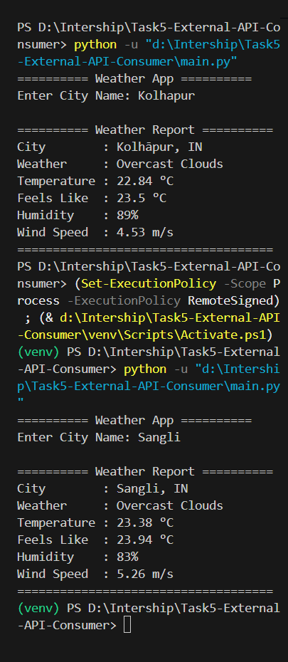

# 🌦️ External API Consumer

## 📌 Overview

This project is a Python application that connects to the OpenWeatherMap REST API to fetch live weather information for any city entered by the user.

The application demonstrates how to consume external APIs using Python, send HTTP GET requests, parse JSON responses, and display user-friendly weather information.

---

## 🚀 Features

- Fetches real-time weather data
- Accepts city name as input
- Uses HTTP GET requests
- Parses JSON responses
- Displays:
  - City
  - Country
  - Weather
  - Temperature
  - Feels Like
  - Humidity
  - Wind Speed
- Handles invalid city names
- Handles network errors

---

## 🛠 Technologies Used

- Python 3
- requests
- JSON
- REST API

---

## 📂 Project Structure

```
Task5-External-API-Consumer/
│
├── main.py
├── config.py
├── requirements.txt
├── README.md
└── .gitignore
```


---

## Sample Output



---

---

## Error Handling

- Invalid city name
- No internet connection
- API errors

---

## Learning Outcomes

- REST API integration
- HTTP GET requests
- JSON parsing
- Python requests library
- Exception handling
- Modular Python programming

---

## Author

Vedant Magdum
